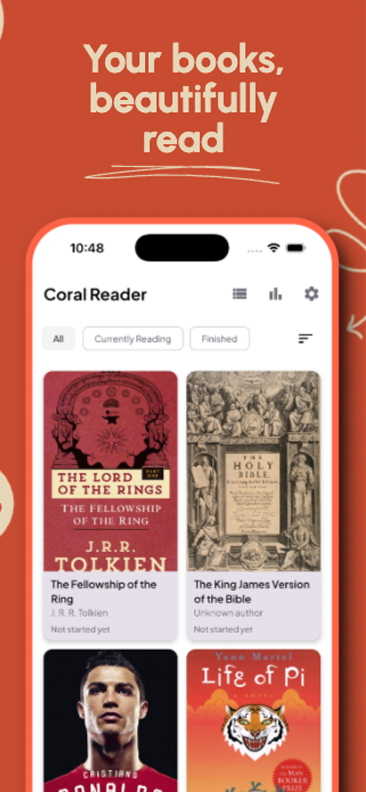
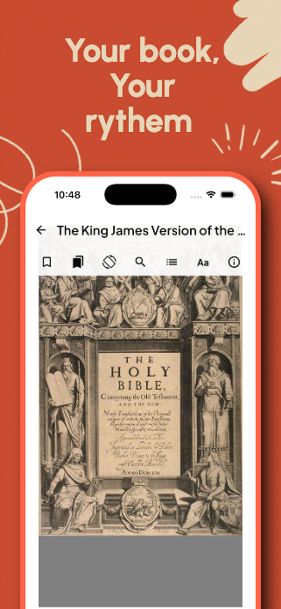
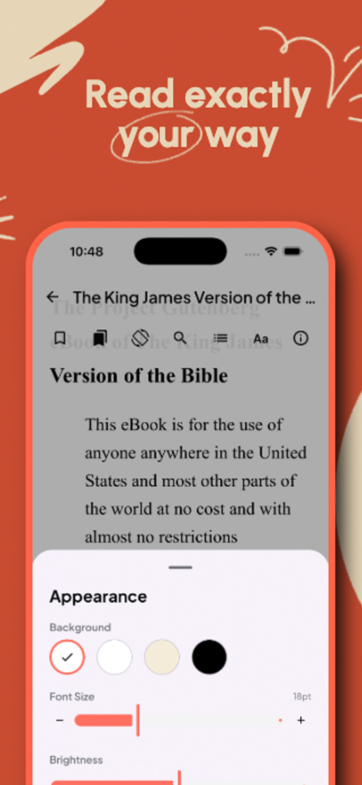
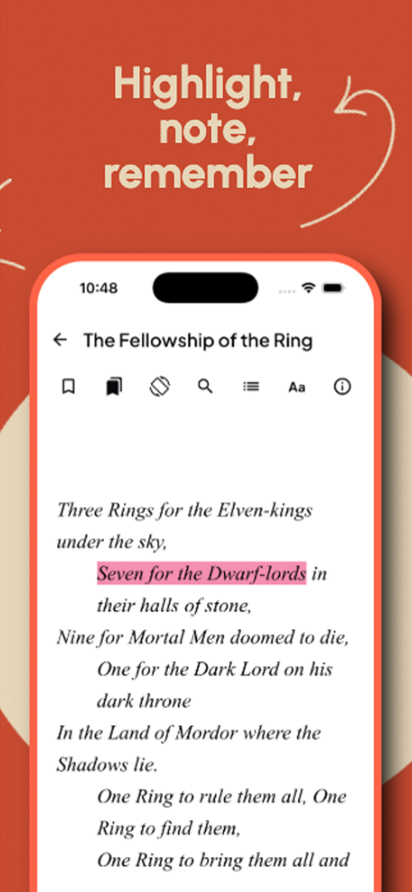

# Coral Reader

### Your books and documents, beautifully read — anywhere.

**A modern, distraction-free reader for EPUB and PDF, built for Android and iOS.**

---

## 📖 Overview

**Coral Reader** turns your phone and tablet into a personal library. Import your
own **EPUB** books and **PDF** documents, and read them with a clean, paginated,
fully customizable experience — then pick up right where you left off on any of
your devices.

Whether you're settling in with a novel, working through a textbook, or reviewing
a PDF report, Coral Reader keeps the focus on the words. No clutter, no noise —
just comfortable, elegant reading.

> **Two formats, one reader.** Coral Reader natively supports both **EPUB** and
> **PDF**, so your entire reading life lives in a single, gorgeous app.

---

## 📸 Screenshots

| | | | |
| :---: | :---: | :---: | :---: |
|  |  |  |  |
| **Your library** | **Your book, your rhythm** | **Read exactly your way** | **Highlight, note, remember** |

---

## 📱 Available on Android & iOS

Coral Reader is built with **Kotlin Multiplatform** and **Compose Multiplatform**,
delivering a true **native** experience on both platforms from a single shared
codebase. The same polished reading experience, whether you're on an iPhone, iPad,
or any Android phone or tablet.

| Android | iOS |
| :---: | :---: |
| Phones & Tablets | iPhone & iPad |

---

## ✨ Features

- 📚 **EPUB & PDF Support** — Read both EPUB books and PDF documents in one place.
- 📂 **Library Management** — Import, organize, and browse your collection in grid or list view with rich cover art.
- 📄 **Paginated Reader** — Smooth, horizontal page-by-page reading that feels like a real book.
- 🎨 **Reading Customization** — Choose from bundled fonts and fine-tune font size, margins, line height, letter spacing, text alignment, brightness, and color themes.
- ✍️ **Highlights & Notes** — Mark up passages and remember what matters.
- 📊 **Progress Tracking** — Per-book reading position, an interactive progress bar with chapter tooltips, and at-a-glance percentage in your library.
- 🌙 **Light, Dark & System Themes** — Read comfortably day or night.
- 🌍 **Localization** — Full English and Hebrew support, including right-to-left (RTL) layout.
- 🔒 **Rotation Lock** — Lock screen orientation while you read.
- 💎 **Coral Pro** — Unlock the full experience with a flexible subscription (monthly, yearly, or lifetime).
- 🔐 **Privacy-First** — Your books stay on your device.

---

## 🎯 Main Highlights

| | |
| --- | --- |
| **One app, two formats** | Read EPUB and PDF without switching apps. |
| **Truly cross-platform** | Native Android & iOS from a shared codebase. |
| **Made for comfort** | Fonts, themes, spacing, and margins tuned to you. |
| **Never lose your place** | Reliable per-book progress tracking. |
| **Reads your language** | English & Hebrew with full RTL support. |

---

## 🚀 Download

Coral Reader is coming to the **App Store** and **Google Play**.

> ⭐ Star this repository to follow along as we launch on Android and iOS.

---

## 🎨 Branding

Looking for logos, colors, and brand assets? See the **[Branding Guide](BRANDING.md)**.

---

## 📜 Legal

- [Privacy Policy](legal/privacy-policy.html)
- [Terms of Use](legal/terms-of-use.html)
- [Support](legal/support.html)

---

**Coral Reader** — Read beautifully. Anywhere.

