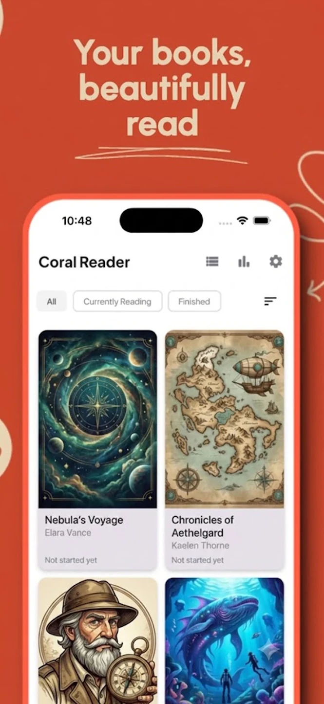
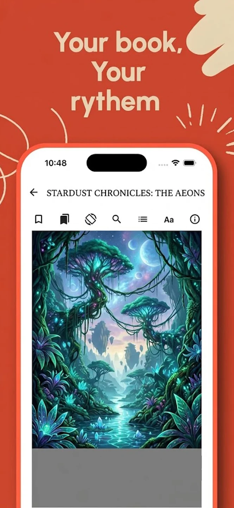
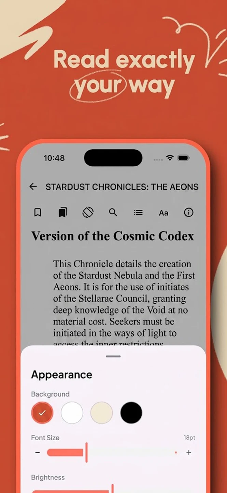
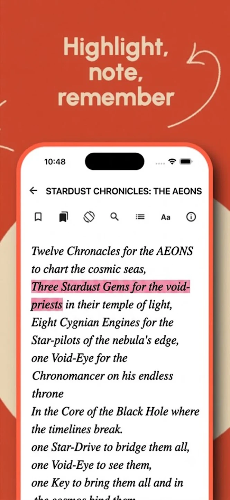

# Coral Reader

### Your books and documents, beautifully read — anywhere.

**A private, beautifully customizable reader for EPUB, PDF, and more, built for Android and iOS.**

---

## 📖 Overview

**Coral Reader** turns your phone and tablet into a personal library. Import your
own **EPUB, PDF, Markdown, text, HTML, FB2, DOCX, and ODT** documents, and read
them with a clean, paginated, fully customizable experience — then pick up right
where you left off.

Whether you're settling in with a novel, working through a textbook, or reviewing
a PDF report, Coral Reader keeps the focus on the words. No clutter, no noise —
just comfortable, elegant reading.

> **Many formats, one reader.** Coral Reader converts supported documents into a
> consistent, reflowable reading experience, so your library feels at home in one app.

---

## 📸 App Preview

| | | | |
| :---: | :---: | :---: | :---: |
|  |  |  |  |
| **Your library** | **Your book, your rhythm** | **Read exactly your way** | **Highlight, note, remember** |

---

## 📱 Available on Android & iOS

Coral Reader is built with **Kotlin Multiplatform** and **Compose Multiplatform**,
delivering a true **native** experience on both platforms from a single shared
codebase. The same polished reading experience, whether you're on an iPhone, iPad,
or any Android phone or tablet.

| Android | iOS |
| :---: | :---: |
| Phones & Tablets | iPhone & iPad |

---

## ✨ Features

- 📚 **Broad Format Support** — Read EPUB, PDF, Markdown, text, HTML, FB2, DOCX, and ODT in one place.
- 🗂️ **Categories & Library Filters** — Create categories, add a book to more than one, and filter alongside All, In Progress, and Finished.
- 🔊 **Read Aloud** — Listen with on-device voices, synchronized highlighting, automatic page follow, background playback, and voice and speed controls.
- 🌐 **Offline Translation** — Translate selected English and Hebrew text in place with downloaded on-device models. Book text never goes to a translation server.
- 📂 **Library Management** — Import, search, organize, and browse your collection in grid or list view with rich cover art.
- 📄 **Flexible Page Turning** — Choose tap, swipe, or both, with paginated reading and direction-aware navigation.
- 🎨 **Reading Customization** — Choose from bundled fonts and fine-tune font size, margins, line height, letter spacing, text alignment, brightness, and color themes.
- ✍️ **Highlights, Notes & Footnotes** — Mark passages, save thoughts, and open footnotes without losing your place.
- 📊 **Progress & Reading Stats** — Track position, chapters, time, pages, finished books, and reading streaks.
- 🌙 **Light, Dark & System Themes** — Read comfortably day or night.
- 🌍 **Localization** — Full English and Hebrew support, including right-to-left (RTL) layout.
- 🔒 **Rotation Lock** — Lock screen orientation while you read.
- 💎 **Coral Pro** — Unlock the full experience with a flexible subscription (monthly, yearly, or lifetime).
- 🔐 **Privacy-First** — Your books stay on your device.

---

## 🎯 Main Highlights

| | |
| --- | --- |
| **One app, many formats** | Read books and documents without switching apps. |
| **Read or listen** | Continue with on-device narration and background playback. |
| **Understand in place** | Translate English and Hebrew selections offline. |
| **Your library, organized** | Create categories that match the way you collect books. |
| **Truly cross-platform** | Native Android & iOS from a shared codebase. |
| **Made for comfort** | Fonts, themes, spacing, and margins tuned to you. |
| **Never lose your place** | Reliable per-book progress tracking. |
| **Reads your language** | English & Hebrew with full RTL support. |

---

## 🚀 Download

Coral Reader is available on the **[App Store](https://apps.apple.com/us/app/coral-reader/id6782911744)** and **[Google Play](https://play.google.com/store/apps/details?id=dev.hollander.coralreader&pcampaignid=web_share)**.

---

## 🎨 Branding

Looking for logos, colors, and brand assets? See the **[Branding Guide](BRANDING.md)**.

---

## 📜 Legal

- [Privacy Policy](legal/privacy-policy.html)
- [Terms of Use](legal/terms-of-use.html)
- [Support](legal/support.html)

---

**Coral Reader** — Read beautifully. Anywhere.

